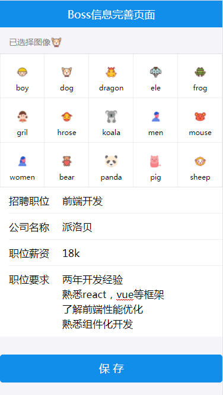

#react-app
 A react project
#克隆项目
git clone https://github.com/songdongdong123/react-app.git
#新建并且换到本地dev分支
git checkout -b dev
#更新代码
git pull origin dev
#安装依赖
cnpm install
#安装MongoDB
#进入安装根目录启动启动MongoDB
mongod
#安装nodemon
npm install nondmon -g
#进入server目录下
nodemon server.js
#启动项目
npm start

