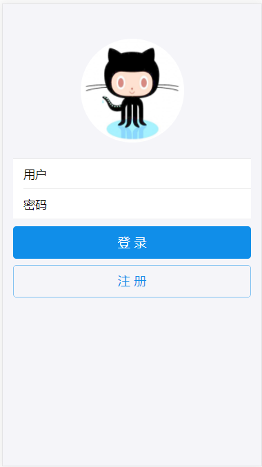
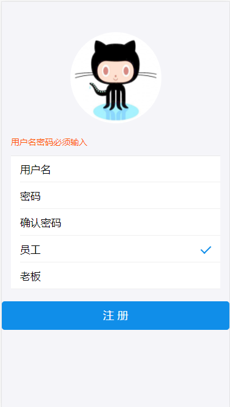
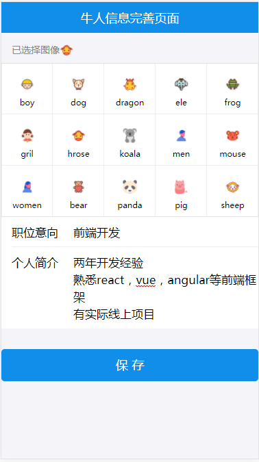
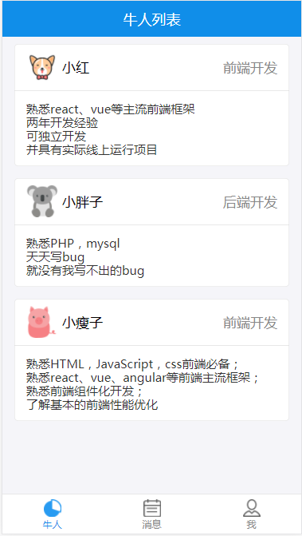
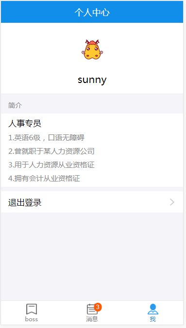
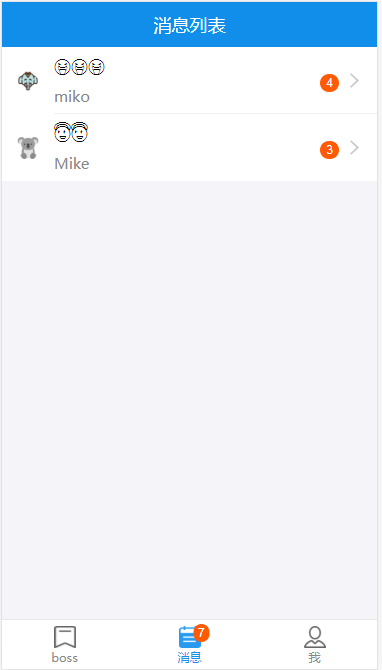
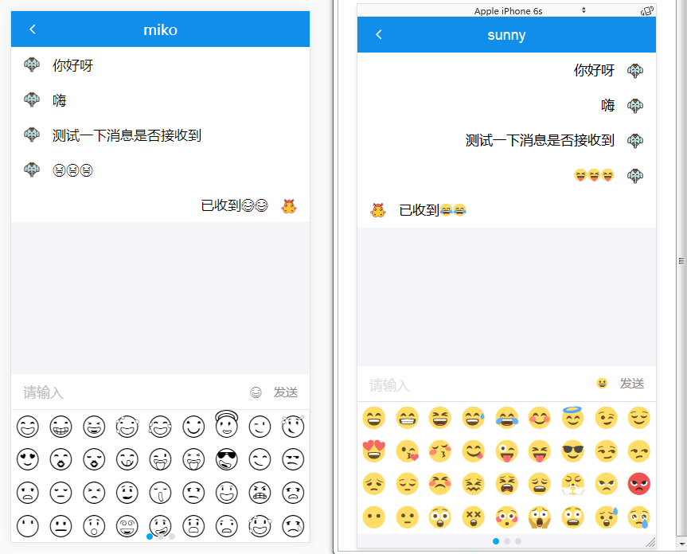

#react-app<br>
```
>>A react project
```
#克隆项目<br>
```
>>git clone https://github.com/songdongdong123/react-app.git
```
#新建并且换到本地dev分支<br>
```
>>git checkout -b dev
```
#更新代码<br>
```
>>git pull origin dev
```
#安装依赖<br>
```
>>cnpm install
```
#安装MongoDB<br>
#进入安装根目录启动启动MongoDB<br>
```
>>mongod
```
#安装nodemon<br>
```
>>npm install nondmon -g
```
#进入server目录下<br>
```
>>nodemon server.js
```
#启动项目<br>
```
>>npm start
```
<br>







